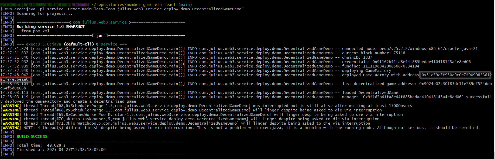
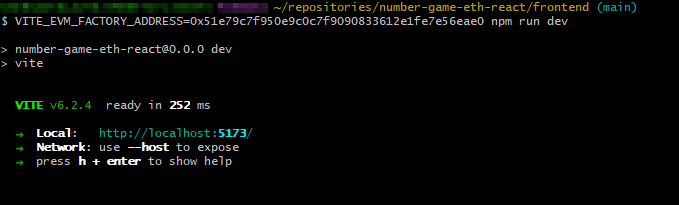
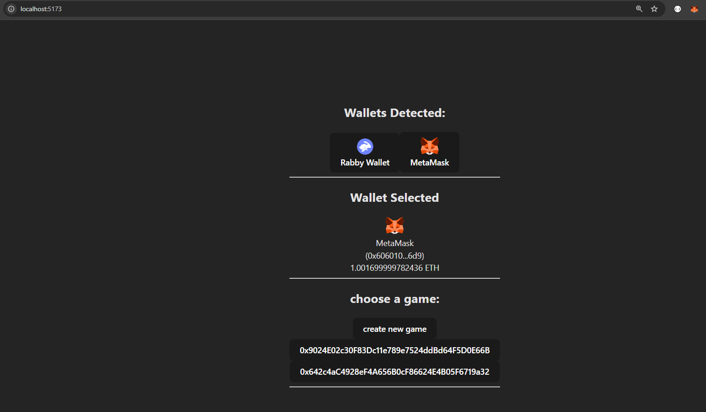

# NumberGameSolidity

## start a local blockchain node
``` bash
besu --network=dev --miner-enabled --miner-coinbase=0x633CBDb4698A5d8092a0f192Af719c8f5F489cC9 --rpc-http-cors-origins="all" --host-allowlist="*" --rpc-ws-enabled --rpc-http-enabled --data-path=/tmp/tmpDatdir
```

alternatively you could play around on Polygon Amoy with the in the frontend predefined factory address without an own node

## setup Game environment (if fresh local setup)

### Prerequisites
* Java 21
* running EVM based blockchain node (e.g. Hyperledger Besu)

### setup
* build the Maven project once from the projects root path
``` bash
mvn clean install
``` 
* open DecentralizedGameDemo.java and start the main method
  * alternatively execute the following bash command: 
``` bash
mvn exec:java -pl service -Dexec.mainClass="com.julius.web3.service.deploy.demo.DecentralizedGameDemo"
```
* it's also possible to switch the EVM node address (EVM_NODE_ADDRESS) in case it's not localhost, set a key file password (KEY_FILE_PASSWORD) or the key file path (KEY_FILE_PATH)
  * example:
``` bash
KEY_FILE_PASSWORD="testSecurePassword" KEY_FILE_PATH="./keys/keyfileXYZ.json" EVM_NODE_ADDRESS="http://localhost:8545/" mvn exec:java -pl service -Dexec.mainClass="com.julius.web3.service.deploy.demo.DecentralizedGameDemo"
```

result:

you can copy the "GameFactory address" from the commandline to continue with your frontend startup.

## Start the frontend

### Prerequisites
* node version 18+, I tested with node v18.20.8
* running EVM based blockchain node (e.g. Hyperledger Besu), ideally the same one as before

#### install npm dependencies
inside the root directory of this project call:

``` bash
cd frontend
npm install
```

### run the frontend
inside the root directory of this project call:

``` bash
cd frontend
npm run dev
```

you're also able to define a factory contract address via the environment variable "VITE_EVM_FACTORY_ADDRESS", for example:
``` bash
cd frontend
VITE_EVM_FACTORY_ADDRESS=0x51e79c7f950e9c0c7f9090833612e1fe7e56eae0 npm run dev
```
or change the variable in "frontend/.env"

this example factory address is the one from the mvn commandline call above.\
Please keep in mind that a blockchain address is specific for one chain, so if you want to switch between different chains, you will need to restart the frontend with a different factory address



### open in the browser
please follow the instruction on the commandline and open http://localhost:5173/ in your browser

don't be confused that there are already two games, the first one is created via the DecentralizedGameDemo java class.\
And I already created the second one manually via the browser frontend before taking a screenshot.



## play around with different accounts